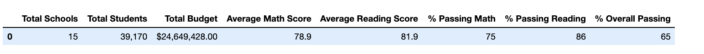
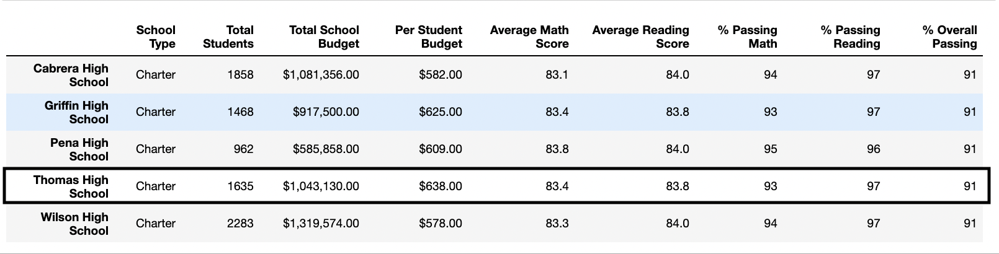
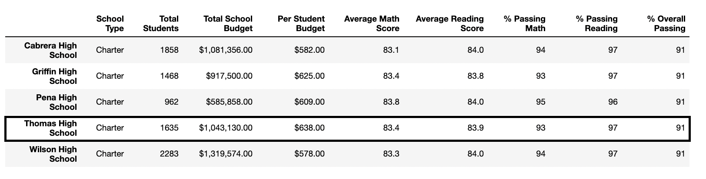

# School_District_Analysis
Working with Jupyter Notebook and Pandas to analyze school district funding and test score data. 

## Overview: 
Explain the purpose of this analysis.

## Results: 
Using bulleted lists and images of DataFrames as support, address the following questions (explain how each of the seven school 
district metrics was affected by changes in the data). 

- How is the district summary affected?

| District Summary Before Changes |  District Summary After Changes |
:-------------------------:|:-------------------------:
 | 

- How is the school summary affected?

| School Summary Before Changes |  School Summary After Changes |
:-------------------------:|:-------------------------:
 | 

- How does replacing the ninth graders’ math and reading scores affect Thomas High School’s performance relative to the other schools?

| Top Schools Before Changes |  Top Schools After Changes |
:-------------------------:|:-------------------------:
 | 

- How does replacing the ninth-grade scores affect the following:
  - Math and reading scores by grade
  
| School Summary Before Changes |  School Summary After Changes |
:-------------------------:|:-------------------------:
 | 

  - Scores by school spending
  
| School Summary Before Changes |  School Summary After Changes |
:-------------------------:|:-------------------------:
 | 

  - Scores by school size
  
| School Summary Before Changes |  School Summary After Changes |
:-------------------------:|:-------------------------:
 | 

  - Scores by school type
  
| School Summary Before Changes |  School Summary After Changes |
:-------------------------:|:-------------------------:
 | 

## Summary: 
Summarize four major changes in the updated school district analysis after reading and math scores for the ninth grade at Thomas High School have been replaced with NaNs.
