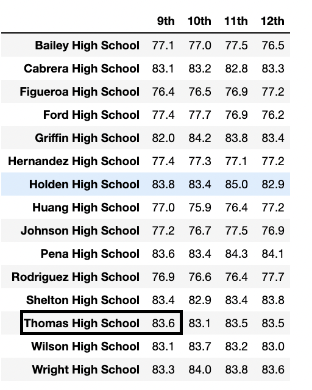
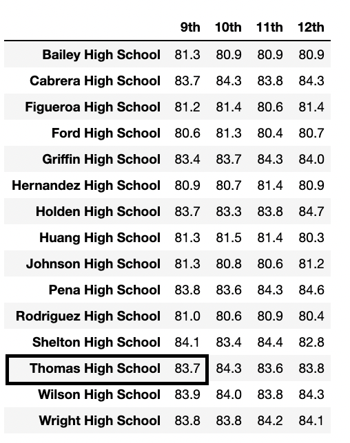
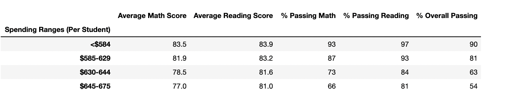
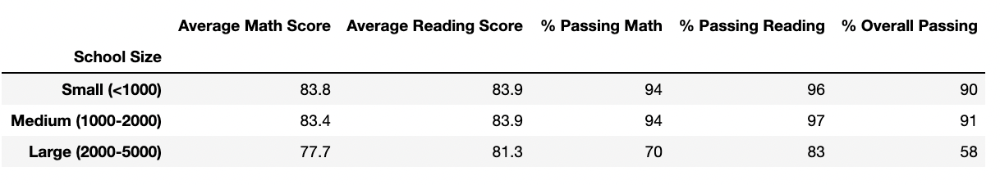

# School_District_Analysis
Working with Jupyter Notebook and Pandas to analyze school district funding and test score data. 

## Overview: 
The purpose of this analysis was to find and showcase school district trends between school performance and budget, size and type in order to help aide the school board in future decisions related to the school district. 

Further, in order to uphold state testing standards, test performance data for 9th grade students at Thomas High School were removed due to suspected academic dishonesty. This analysis also showcases any impacts that removing the test performance data had on the overall analysis. 

## Results:  

#### How was the district summary affected?

| District Summary Before Changes |  District Summary After Changes |
:-------------------------:|:-------------------------:
 | 

The side-by-side images above display school district summary data both before and after the removal of Thomas High School 9th graders' test performance data. It should be noted that this removal impacted 461 students, so although the displayed total student population remains constant, calculations for "average scores" and "percent passing" were made using a total of 38,709 students (rather than 39,170) for the image on the right. 

There appears to have been very little impact to the district summary performance data based on the changes made, with only "Average Math Score" moving down by a tenth of a percentage. This is not entirely surprising, as the removed test scores accounted for only approximately 0.01% of the district's student population. 

#### How was the school summary affected?

| School Summary Before Changes |  School Summary After Changes |
:-------------------------:|:-------------------------:
 | 

Examining the images above, obviously there was no change to the school summary for schools other than the one for which some performance data was removed, Thomas High School. Even for Thomas High School, the change had very minimal impact, with only "Average Reading Score" improving by a tenth of a percentage. 

#### How did replacing the ninth graders’ math and reading scores affect Thomas High School’s performance relative to the other schools?

| Top Schools Before Changes |  Top Schools After Changes |
:-------------------------:|:-------------------------:
 | 

Based on the images above, it is clear that replacing the ninth graders' math and reading scores did not affect Thomas High School's performance ranking in comparison with other schools, with Thomas High School remaining the fourth highest-performing school in the district after the changes. 

#### How did replacing the ninth graders' math and reading scores at Thomas High School affect the following? : 

`Math and reading scores by grade:`
  
| Math Scores by Grade |  Reading Scores by Grade |
:-------------------------:|:-------------------------:
 | 

Based on the changes, there was no impact to students' math and reading scores by grade, other than the removal of the 9th grade test scores for Thomas High School students (outlined in the images above). 

`Scores by school spending:`
  
| School Spending Scores Before Changes |  School Spending Scores After Changes |
:-------------------------:|:-------------------------:
 | 

It can be deduced from the images above that there were no significant impacts to the analysis of school performance based on budget. 

`Scores by school size:`
  
| School Size Scores Before Changes |  School Size Scores After Changes |
:-------------------------:|:-------------------------:
 | 

It can be deduced from the images above that there were no significant impacts to the analysis of school performance based on school size. 

`Scores by school type:`
  
| School Type Scores Before Changes |  School Type Scores After Changes |
:-------------------------:|:-------------------------:
 | 

It can be deduced from the images above that there were no significant impacts to the analysis of school performance based on school type. 

## Summary: 
The only significant changes to the school district analysis after the removal of Thomas High School 9th graders' test scores were: 
1. The school district's average math testing score decreased by a tenth of a percent; 
2. Thomas High School's average reading testing score improved a tenth of a percent; 
3. Thomas High School's 9th grade math scores were removed from the "Math Scores By Grade" analysis; and 
4. Thomas High School's 9th grade reading scores were removed from the "Reading Scores By Grade" analysis. 
